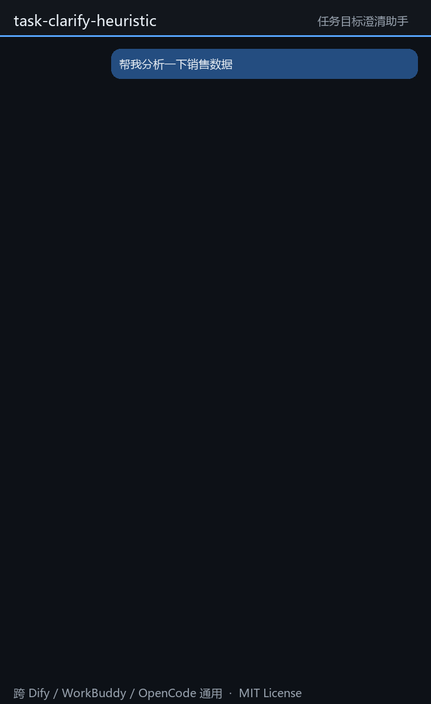
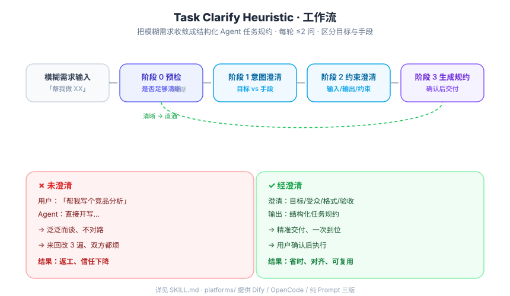

# 🎯 Task Clarify Heuristic

> **让 Agent 不再跑偏的任务澄清 Skill** —— 用启发式多轮提问，把「模糊需求」收敛成「结构化、可执行的 Agent 任务规约」。

[](./LICENSE)
[](./platforms)
[](./README_EN.md)
[](./SKILL.md)

<p align="center">
  
</p>

> 一句话：**市面上的 prompt 都教你怎么给 Agent 下指令，这个 Skill 帮你先把模糊需求变成清晰指令。**

---

## 📌 痛点

你给 Agent 说「帮我写个竞品分析」「帮我加个导出功能」「帮我分析下这个市场」——结果往往：

- Agent 直接开干，产出泛泛而谈、不对路
- 来回改 3 遍，双方都累
- 最后发现「你要的根本不是这个」

**根因：90% 的跑偏不是 Agent 笨，而是任务定义本身缺了目标、边界和验收标准。**

## ✨ 核心特性（市面少见）

| # | 特性 | 为什么有用 |
|---|------|-----------|
| 1 | **区分「手段」与「业务目标」** | 用户说「写 PPT」，真实目标可能是「说服客户采购」。目标不清，手段全白做。 |
| 2 | **自动猜测补全** | 信息不足时主动给假设让用户确认，而非把问题全抛回去——减少用户负担。 |
| 3 | **跨平台可移植** | 产出是纯文本任务规约，可直接复制给 Dify / OpenCode / 任何 Agent。不绑定单一平台。 |
| 4 | **每轮 ≤ 2 问** | 拒绝大问卷，避免用户敷衍，澄清更准。 |
| 5 | **复杂度预检** | 简单任务直通、复杂任务深挖，不浪费每一轮对话。 |

## 🖼️ 工作流一览



## 🚀 快速开始

**WorkBuddy 用户**（最简单）：把 `SKILL.md` 放进你的 skills 目录即可自动触发：

```bash
cp SKILL.md ~/.workbuddy/skills/task-clarify-heuristic/SKILL.md
```

**Dify / OpenCode / 其他平台**：见 [`platforms/`](./platforms/) 三份适配版，复制即用。

## 📦 安装

### WorkBuddy
1. 复制 [`SKILL.md`](./SKILL.md) 到 `~/.workbuddy/skills/task-clarify-heuristic/`
2. 当你的任务描述模糊时，Skill 会自动触发澄清流程

### 其他平台（Dify / OpenCode / 纯 Prompt）
| 平台 | 文件 | 用法 |
|------|------|------|
| 纯 Prompt | [`platforms/pure-prompt.md`](./platforms/pure-prompt.md) | 整段作为 System Prompt 粘贴 |
| Dify | [`platforms/dify-prompt.md`](./platforms/dify-prompt.md) | 作为「澄清节点」前置，输出 `task_spec` 变量 |
| OpenCode | [`platforms/opencode-system.md`](./platforms/opencode-system.md) | 追加到 system_prompt，编码前先澄清 |

## 📂 目录结构

```
task-clarify-heuristic/
├── SKILL.md                 # WorkBuddy 版（内核 + 平台衔接）
├── README.md                # 本文档
├── README_EN.md             # 英文文档
├── LICENSE                  # MIT
├── assets/
│   └── demo-flow.svg        # 工作流示意图
├── platforms/               # 跨平台适配版
│   ├── pure-prompt.md       # 零平台依赖纯提示词
│   ├── dify-prompt.md       # Dify 适配
│   └── opencode-system.md   # OpenCode 适配
└── examples/                # 完整对话示例
    ├── code-task.md         # 代码功能任务
    ├── content-task.md      # 内容创作任务
    └── research-task.md     # 研究分析任务
```

## 💡 完整示例

### Before / After

**Before（未澄清）**
> 用户：「帮我写个竞品分析。」
> Agent 直接输出一篇泛泛的「行业三大玩家对比」，没有你的业务视角，看完用不上。

**After（经本 Skill 澄清）**
```text
# Agent 任务规约【经澄清确认】
## 业务目标：评估自研 vs 采购 OCR 能力，支撑 Q4 选型决策
## 受众与用途：给技术 VP 与采购总监的选型参考
## 验收成功标准：给出明确推荐结论 + 成本/能力二维对比表
## 不在本次任务范围：不做 POC 实测、不写招标文档
## 可用输入上下文：现有供应商清单（可联网查公开数据）
## 输出要求：格式=Markdown 报告；约束=含 TCO 测算
## 工具权限：允许调用工具=true
```

更多跨类型完整对话见 [`examples/`](./examples/)：
- [`code-task.md`](./examples/code-task.md) —— 「帮我加个导出功能」
- [`content-task.md`](./examples/content-task.md) —— 「帮我写篇公众号推文」
- [`research-task.md`](./examples/research-task.md) —— 「帮我分析下这个市场」

## ❓ FAQ

**Q：和普通的「请先问清楚再回答」提示词有什么区别？**
A：普通提示词只是「多问几句」。本 Skill 有分层阶段（意图→约束→规约）、复杂度预检、手段/目标区分、自动猜测机制，并产出**结构化可复用规约**而非零散问答。

**Q：每轮真的只问 2 个吗？**
A：最多 2 个，避免大问卷。相关度高的可合并，但严格不超过 2。这是 UX 设计，不是随意限制。

**Q：能用于非中文 Agent 吗？**
A：核心方法论与 [`platforms/pure-prompt.md`](./platforms/pure-prompt.md) 为英文，可服务英文场景；中文 README 见 [`README.md`](./README.md)，英文见 [`README_EN.md`](./README_EN.md)。

**Q：澄清完之后 Agent 会自己执行吗？**
A：不会。HARD GATE 要求用户**明确确认**规约后才执行，避免「边干边澄清」的浪费。

## 🤝 贡献

欢迎提 Issue / PR：补充更多任务类型的分类题库、更多平台适配、更多示例。提交前请阅读行为准则（友好、就事论事）。

## 📄 License

[MIT](./LICENSE) © 2026 老罗 (Luo)
